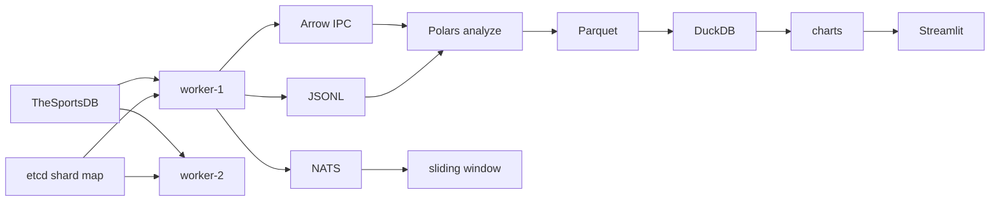

# Отчёт по лабораторной работе №14

> **Титульный лист:** [TITLE.md](TITLE.md)  
> **Чеклист соответствия:** [METHODOLOGY_CHECKLIST.md](METHODOLOGY_CHECKLIST.md)

---

## 1. Титульный лист

| Поле | Значение |
|------|----------|
| Работа | №14 |
| Вариант | 18 — спортивная статистика |
| Студент | Тарасов Вадим Романович |
| Группа | 221131 |
| Источник | TheSportsDB API (футбол + хоккей) |
| Уровень | Повышенный |

---

## 2. Техническое задание

Построить ETL-конвейер: **Go-сборщик** → **JSON / NATS / Apache Arrow IPC** → **Polars** → **Parquet** → **DuckDB** → **визуализация** → **Streamlit**.

Повышенные требования: etcd-координация, oконная агрегация, Arrow, Rust-валидация, K8s HPA, benchmark Go/Python, NATS, real-time dashboard.

---

## 3. Результаты выполнения заданий

### 3.1 Базовые (1–10)

| № | Результат |
|---|-----------|
| 1 | Go-сборщик с goroutines, JSONL в `data/matches_*.jsonl` |
| 2 | Канал `eventsCh` (256), batch 15 записей / 5 сек |
| 3 | SIGINT/SIGTERM → flush буфера, закрытие NATS/etcd |
| 4 | Polars: 5 строк, schema, null counts |
| 5 | Очистка + Rust/Python валидация |
| 6 | GROUP BY sport, league_name → SUM, AVG, MIN, MAX, COUNT |
| 7 | `output/matches_clean.parquet` |
| 8 | DuckDB SQL + замер Polars vs DuckDB |
| 9 | 4 графика (bar, histogram, time series, pie) |
| 10 | `README.md`, `docs/ETCD.md` |

### 3.2 Повышенный уровень

| № | Результат |
|---|-----------|
| 1 | **etcd:** `docker-compose.yml` + шардирование в `assignedLeagues()` |
| 2 | Tumbling window 60 с → `window_aggregates.jsonl`, NATS `sports.windows` |
| 3 | Arrow IPC `data/matches.arrow` → `output/arrow_matches.parquet` |
| 4 | `rust-validator/` + `validator.py` в `analyze.py` |
| 5 | Docker + `k8s/deployment.yaml` (HPA CPU 70%) |
| — | Benchmark: время, память, **CPU**, throughput |
| — | NATS + sliding window 5 мин |
| 6 | Streamlit + autorefresh 3–30 сек |

---

## 4. Архитектура и компоненты



**Компоненты:** Go collector, etcd, NATS, Arrow IPC, Polars, DuckDB, Rust validator, Streamlit.

---

## 5. Анализ производительности

Данные: `output/benchmark_report.json`

| Метрика | Python asyncio | Go goroutines |
|---------|----------------|---------------|
| Событий | 8 | 8 |
| Время (с) | ~0.29 | ~0.32 |
| CPU (с) | ~0.05 | ~0.08 |
| Память (MB) | ~1.9 | ~3.1 |
| Событий/с | ~27 | ~25 |

**Arrow vs JSON:** `arrow_transfer_stats.json` — Arrow IPC ~5× меньше JSON.

**Polars vs DuckDB:** `performance.json` — Polars быстрее на малых данных.

График: `charts/go_vs_python_benchmark.png` (время, память, CPU, throughput).

---

## 6. Примеры работы и скриншоты

### SQL DuckDB

```sql
SELECT league_name, ROUND(AVG(total_goals), 2) AS avg_goals, COUNT(*) AS matches
FROM read_parquet('output/matches_clean.parquet')
GROUP BY league_name
ORDER BY avg_goals DESC;
```

### Скриншоты (`report/screenshots/`)

| Файл | Описание |
|------|----------|
| `avg_goals_by_league.png` | Bar chart |
| `goals_distribution.png` | Histogram |
| `goals_time_series.png` | Time series |
| `sport_share_pie.png` | Pie chart |
| `go_vs_python_benchmark.png` | Benchmark |
| `streamlit_dashboard_preview.png` | Превью дашборда |

---

## 7. Выводы

1. Конвейер Go → Arrow/NATS → Python полностью реализован для варианта 18.
2. **etcd** распределяет лиги между worker-1 и worker-2 (см. `docs/ETCD.md`).
3. Arrow IPC снижает объём передаваемых данных относительно JSON.
4. Benchmark фиксирует время, память и CPU для Go и Python.
5. Streamlit-дашборд поддерживает автообновление по потоку данных.

---

## 8. Список источников

1. https://go.dev/doc/effective_go#concurrency  
2. https://pola.rs/  
3. https://duckdb.org/  
4. https://arrow.apache.org/  
5. https://www.thesportsdb.com/api.php  
6. https://nats.io/  
7. https://etcd.io/  
8. https://github.com/vadeetar/Laba-14  

---

## 9. Приложения

### A. etcd-шардирование (Go)

```go
// assignedLeagues — league_index % workers_count == worker_index
resp, _ := c.etcd.Get(ctx, "/lab14/workers/", clientv3.WithPrefix())
```

### B. Graceful shutdown

```go
signal.Notify(sigCh, syscall.SIGINT, syscall.SIGTERM)
collector.flushBuffer(true)
```

### C. Arrow IPC export

```go
writer := ipc.NewWriter(file, ipc.WithSchema(record.Schema()))
writer.Write(record)
```

### D. Polars агрегация

```python
df.group_by(["sport", "league_name"]).agg(
    pl.col("total_goals").sum(),
    pl.col("total_goals").mean(),
    pl.len(),
)
```

### E. Файлы проекта

- `go-collector/cmd/collector/` — сборщик  
- `python/analyze.py` — анализ  
- `python/dashboard.py` — дашборд  
- `docker-compose.yml` — etcd + NATS + workers  
- `rust-validator/src/lib.rs` — валидация  
