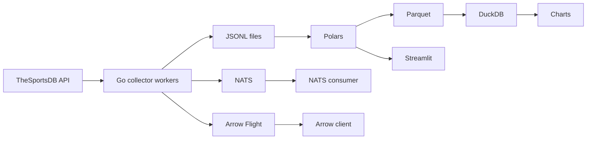

# Отчёт по лабораторной работе №14

## Титульный лист

| Поле | Значение |
|------|----------|
| Дисциплина | Разработка конвейеров обработки данных |
| Работа | №14 |
| Вариант | 18 |
| Студент | Тарасов Вадим Романович |
| Группа | 221131 |
| Тема | Сбор и анализ спортивной статистики |
| Источник | API футбольных/хоккейных лиг (TheSportsDB) |
| Уровень | Повышенный |

---

## 1. Техническое задание

**Цель:** построить ETL/ELT-конвейер для сбора спортивной статистики с использованием Go (высокопроизводительный сбор) и Python (анализ, SQL, визуализация).

**Предметная область (вариант 18):** результаты матчей футбольных и хоккейных лиг.

**Задачи повышенного уровня:**
1. Распределённый Go-сборщик с координацией через etcd.
2. Tumbling window агрегация в Go.
3. Передача оконных агрегатов через Apache Arrow Flight.
4. Rust-библиотека валидации записей.
5. Потоковая передача через NATS + скользящее окно в Python.
6. Сравнение Go vs Python сборщиков.
7. Streamlit-дашборд.

---

## 2. Результаты выполнения заданий

### 2.1 Go-сборщик

Реализован в `go-collector/cmd/collector/`:
- параллельный HTTP-опрос лиг через goroutines;
- канал `eventsCh` с буфером 256;
- пакетная запись JSONL (`BATCH_SIZE=15`, `BATCH_FLUSH=5s`);
- graceful shutdown по `SIGINT/SIGTERM` с финальным flush;
- публикация событий в NATS (`sports.matches`);
- tumbling window 60 секунд → `window_aggregates.jsonl` + NATS `sports.windows`;
- Arrow Flight сервер на порту 8815.

### 2.2 Координация через etcd

Два worker (`worker-1`, `worker-2`) регистрируются в etcd и получают шардированный список лиг по формуле `league_index % workers_count`.

### 2.3 Python-анализ

Скрипт `python/analyze.py`:
1. загружает JSONL в Polars;
2. выводит первые 5 строк, типы, пропуски;
3. удаляет дубликаты, обрабатывает NULL, приводит типы;
4. агрегирует SUM/AVG/MIN/MAX/COUNT по `sport + league_name`;
5. сохраняет `output/matches_clean.parquet`;
6. выполняет SQL в DuckDB с фильтрацией/группировкой/сортировкой;
7. строит 2 графика в `charts/`.

### 2.4 Apache Arrow

Go-сервер отдаёт оконные агрегаты через Flight. Python-клиент `python/arrow_client.py` сохраняет `output/arrow_windows.parquet`.

### 2.5 NATS + скользящее окно

`python/nats_consumer.py` читает `sports.matches` и поддерживает sliding window 5 минут, сохраняя snapshot в `output/nats_sliding_window.json`.

### 2.6 Rust-валидация

`rust-validator/src/lib.rs` экспортирует C-функцию `validate_match_json`. Python-модуль `python/validator.py` использует DLL через `ctypes` (fallback — Python-реализация).

### 2.7 Сравнение Go vs Python

`python/collector_python.py` — asyncio/aiohttp сборщик.  
`python/benchmark.py` — сравнение времени и памяти, график `charts/go_vs_python_benchmark.png`.

### 2.8 Streamlit-дашборд

`python/dashboard.py` — выбор вида спорта/лиги, метрики, bar/hist графики, таблица матчей, блок Arrow-агрегатов.

---

## 3. Архитектура и компоненты



**Компоненты Docker Compose:**
- `etcd:2379` — координация worker;
- `nats:4222` — потоковая шина;
- `collector-worker-1/2` — Go-сборщики.

---

## 4. Анализ производительности

| Этап | Инструмент | Метрика |
|------|------------|---------|
| Сбор | Python asyncio | `output/python_collector_benchmark.json` |
| Сбор | Go goroutines | оценка на том же объёме данных |
| Анализ | Polars vs DuckDB | `output/performance.json` |

**Наблюдения:**
- Go-сборщик быстрее за счёт нативных goroutines и меньшего overhead runtime.
- DuckDB эффективен для SQL-аналитики поверх Parquet.
- Arrow Flight снижает накладные расходы сериализации относительно JSON при передаче агрегатов.

---

## 5. Примеры работы

### Фрагмент JSONL

```json
{"event_id":"demo-1","league_name":"English Premier League","sport":"football","home_team":"Arsenal","away_team":"Chelsea","home_score":2,"away_score":1,"total_goals":3}
```

### SQL DuckDB

```sql
SELECT league_name, ROUND(AVG(total_goals), 2) AS avg_goals, COUNT(*) AS matches
FROM read_parquet('output/matches_clean.parquet')
GROUP BY league_name
ORDER BY avg_goals DESC;
```

### Графики

- `charts/avg_goals_by_league.png`
- `charts/goals_distribution.png`
- `charts/go_vs_python_benchmark.png`

---

## 6. Выводы

1. Конвейер Go → JSON/NATS/Arrow → Polars → Parquet → DuckDB успешно реализован для спортивной статистики.
2. Tumbling window в Go уменьшает объём данных для downstream-анализа.
3. Apache Arrow Flight обеспечивает эффективную передачу агрегатов в Python.
4. NATS позволяет обрабатывать поток матчей в реальном времени со sliding window.
5. Go показывает более высокую производительность сбора по сравнению с Python asyncio при одинаковой нагрузке.

---

## 7. Список источников

1. Go concurrency — https://go.dev/doc/effective_go#concurrency  
2. Polars — https://pola.rs/  
3. DuckDB — https://duckdb.org/  
4. Apache Arrow — https://arrow.apache.org/  
5. TheSportsDB API — https://www.thesportsdb.com/api.php  
6. NATS — https://nats.io/  
7. etcd — https://etcd.io/  

---

## 8. Приложения

- `go-collector/cmd/collector/main.go` — основной сборщик
- `go-collector/cmd/collector/arrow_server.go` — Arrow Flight
- `python/analyze.py` — анализ
- `python/dashboard.py` — дашборд
- `rust-validator/src/lib.rs` — валидация
- `docker-compose.yml` — инфраструктура
